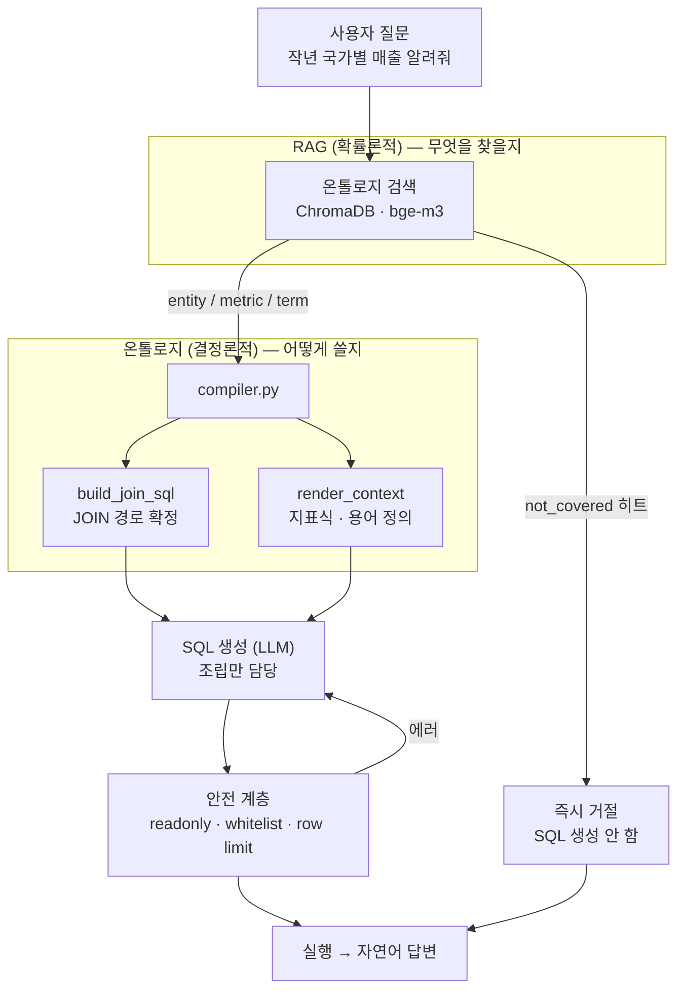

# 온톨로지 기반 Text-to-SQL

## 한 줄 요약

자연어 질의를 SQL로 변환하는 BI 시스템 — **정답이 정해진 지식은 온톨로지(YAML)로 하드코딩**하고,
**탐색이 필요한 지식은 RAG로 검색**하는 하이브리드 아키텍처.
dbt 스타 스키마 위에 커스텀 온톨로지를 얹고, LangGraph 에이전트가 그 온톨로지를 근거로만 SQL을 만든다.

---

## 문제 정의 (Why)

- 현업 담당자가 SQL 없이 데이터에 접근하려 할 때, 가장 큰 걸림돌은 **접근성이 아니라 신뢰도**다.
- 순수 LLM 기반 Text-to-SQL은 정확도/일관성을 보장하기 어렵다. 선행 프로젝트(원본 스키마를 벡터 검색해 LLM에 넣는 방식)에서 관찰한 실패 패턴:

| 문제 | 원본 스키마 RAG | 온톨로지 + 시맨틱 레이어 |
|---|---|---|
| `InvoiceLine` 같은 무의미한 테이블명 | 임베딩이 못 찾음 | `판매`라는 **비즈니스 이름**으로 검색 |
| JOIN 경로 | LLM이 매번 추론 (틀릴 수 있음) | 온톨로지가 **경로를 확정해서 제공** |
| "매출"의 정의 | 매번 LLM이 새로 해석 | `metrics.yml`에 **한 번만** 정의 |
| 정규화된 5개 테이블 JOIN | 매번 LLM이 조립 | dbt가 **미리 조립** (`fct_sales`) |
| 같은 질문 → 다른 SQL | 자주 발생 | 정의가 고정돼 재현성 확보 |
| DB에 없는 정보 ("직원 연봉") | 컬럼을 지어냄 | `not_covered`로 **SQL 생성 전에 차단** |

→ 필요한 건 더 좋은 프롬프트가 아니라 **"정답이 있는 것과 없는 것을 구분하는" 아키텍처**였다.

핵심 아이디어는 **LLM에게 자유를 덜 주는 것**이다. 물리 스키마를 통째로 던지고 알아서 하라는 대신,
비즈니스 개념(엔티티·지표·관계)만 보여주고 그 안에서 조합하게 한다.

---

## 아키텍처



데이터가 흐르는 물리 경로:

```
Chinook.db (SQLite)
      |  scripts/load_chinook.py
      v
PostgreSQL  raw 스키마              <- 원본 적재 (snake_case 변환)
      |  dbt run
      v
PostgreSQL  analytics_staging(view) + analytics_marts(table)
      |                                dim_customer, dim_track, dim_employee, fct_sales
      |
ontology/*.yml                       <- 사람이 쓰는 비즈니스 정의 (마트 컬럼에 매핑)
      |  src/ontology/compiler.py
      v
검색 문서 + JOIN SQL + 프롬프트 컨텍스트
      |  src/retrieval, src/agent
      v
LangGraph 에이전트 -> SQL -> 실행 -> 답변
```

**계층 3개의 역할 분담**이 이 프로젝트의 뼈대다.

| 계층 | 담당하는 질문 | 도구 | 성격 |
|---|---|---|---|
| 물리 | 데이터를 어떻게 저장/변환할까 | dbt (SQL) | 결정론적 |
| 의미 | 이 컬럼이 비즈니스적으로 무엇인가 | ontology YAML | 결정론적 |
| 대화 | 사용자 말을 의미 계층에 어떻게 매핑할까 | LangGraph + LLM | 확률론적 |

확률론적 계층은 **"무엇을 고를지"만** 결정한다. 테이블·조인·지표식은 전부 결정론적 계층이 제공한다.

---

## 핵심 설계 결정 (Design Decisions)

| 결정 | 이유 | 트레이드오프 |
|---|---|---|
| 마트를 스타 스키마로 **미리 조인** (`dim_track`에 장르·앨범·아티스트 포함) | LLM이 4중 조인을 짤 일이 사라짐. LLM이 할 일을 줄이는 게 정확도를 올리는 가장 확실한 방법 | dbt 빌드 스텝 추가, 저장 공간 중복 |
| 팩트 grain을 **invoice_line 단위**로 고정 | 가장 잘게 쪼개야 어떤 질문에도 답할 수 있음 (invoice 단위면 "장르별 매출"을 영원히 못 구함) | 행 수가 많아짐, 주문 단위 지표는 `COUNT(DISTINCT)` 필요 |
| 지표를 `metrics.yml`에 **SQL 식으로 고정** | "매출이 뭐냐"를 한 번만 정하면 누가 묻든 같은 숫자가 나옴 | 새 지표마다 사람이 등록해야 함 (개발 속도 ↓) |
| YAML → **dataclass 변환** (`models.py`가 스키마 계약서) | `synonym` vs `synonyms` 오타를 실행 시점이 아니라 **로딩 순간에** 터뜨림 | 필드 추가 시 YAML/dataclass 두 곳 수정 |
| `not_covered` 섹션으로 **사전 차단** | "연봉 얼마야?"에 SQL 생성 자체를 건너뜀 → 비용도 아끼고 환각도 막음 | 유사도 임계값 튜닝 필요, 과차단 위험 |
| 검색 문서를 **kind별로 분리** (entity/metric/term/not_covered) | "매출"→metric, "활성 고객"→term이 각각 독립적으로 잡힘 | 검색 호출 수 증가 |
| 지표 문서에 **expression을 넣지 않음** | SQL 조각은 검색에 도움이 안 되고 노이즈만 늘림 (검색 후 `render_context`에서 붙임) | 문서와 프롬프트 조립 로직이 분리돼 추적할 곳이 늘어남 |
| 상대 기간("작년")을 **데이터 최대 연도 기준**으로 정의 | Chinook은 2009~2013 고정. `CURRENT_DATE` 기준이면 결과가 항상 비어 있음 | 데이터가 갱신되면 "작년"의 의미가 바뀜 |
| 검색되지 않은 테이블/컬럼은 **프롬프트에 아예 안 보여줌** | 보이면 쓴다. 안 보이면 못 쓴다 | 검색이 놓치면 답을 못 함 (재현율 의존) |
| Rule-based 우선, LLM은 검증된 이후 단계에 투입 | 실패 케이스를 관찰 가능한 형태로 남길 수 있음 | 초기 개발 속도 느림 |

---

## 거버넌스 & 안전장치

**1. 미보유 정보 차단 (환각 방지)**
`glossary.yml`의 `not_covered`에 이 DB에 없는 주제를 명시한다. 질문이 여기 걸리면 SQL 생성 단계로 가지 않고 바로 거절한다.

```yaml
not_covered:
  - topic: 직원 급여
    synonyms: [연봉, 급여, 월급, 인건비, salary]
    reason: Chinook 의 employee 테이블에는 급여 컬럼이 없습니다.
```

**2. 지표 거버넌스**
`metrics.yml`이 지표의 유일한 진실의 원천(single source of truth). 지표 변경은 곧 YAML 변경이므로 **Git diff로 드러나고 PR 리뷰를 거친다.**
함정은 정의에 미리 박아둔다 — `order_count`는 `COUNT(*)`가 아니라 `COUNT(DISTINCT invoice_id)`, `avg_order_value`는 0 나누기를 `NULLIF`로 막는 것까지 사람이 정해둔다.

**3. SQL 안전 3계층** ([src/db.py](src/db.py))

| 계층 | 방법 | 강도 |
|---|---|---|
| DB 권한 | `rag_reader` 계정에 `analytics_marts` SELECT만 부여. raw/staging은 권한 없음 | 가장 강력 |
| 구문 검사 | 주석·코드펜스를 벗겨낸 뒤 첫 키워드가 `select`/`with`인지 화이트리스트 검사 | 중간 |
| 행 수 제한 | `fetchmany(limit)` | 보조 |

에이전트에게 **마트만 보이게 하는 것 자체가 설계**다.

**4. 온톨로지 ↔ dbt 정합성 검증** ([src/ontology/loader.py](src/ontology/loader.py) `validate()`)
엔티티 이름 중복, 존재하지 않는 관계 끝점, 존재하지 않는 지표 엔티티, `entity.attribute` 형식의 dimension 참조, 실제 마트 테이블 존재 여부를 검사한다.
**온톨로지와 dbt 모델이 어긋나는 것이 가장 흔한 버그**라서, 이 검증을 CI에 넣을 수 있게 문제 목록을 리스트로 반환한다.

**5. 조인 경로 누락 시 시끄럽게 실패**
`build_join_sql()`은 관계를 못 찾으면 조용히 넘어가지 않고 예외를 던진다. 조용히 빠뜨리면 LLM이 데카르트 곱을 만든다.

---

## 기술 스택

`Python 3.13` `dbt-core` `dbt-postgres` `PostgreSQL 16` `LangGraph` `LangChain` `ChromaDB` `Ollama (bge-m3)` `Groq` `SQLAlchemy 2.0` `pandas` `PyYAML`

---

## 프로젝트 구조

```
ontology_text2sql/
├── README.md
├── SETUP.md                  환경 구축 · 단계별 실습 가이드
├── requirements.txt
├── .env.example
├── scripts/
│   └── load_chinook.py       SQLite -> Postgres 적재
├── dbt/
│   ├── dbt_project.yml       staging=view, marts=table
│   ├── profiles.yml          env_var 기반 접속 정보
│   └── models/
│       ├── staging/          원본 정리 (view) — 8개 모델
│       └── marts/            스타 스키마 (table)
│           ├── dim_customer.sql
│           ├── dim_track.sql       곡+장르+앨범+아티스트 사전 조인
│           ├── dim_employee.sql
│           └── fct_sales.sql       한 행 = 주문 상세 1줄
├── ontology/                 비즈니스 의미 정의 (YAML)
│   ├── README.md             온톨로지 작성 가이드
│   ├── entities.yml          무엇이 있나        (customer, sales, track, employee)
│   ├── relationships.yml     어떻게 이어지나    (fct_sales 중심 스타 조인)
│   ├── metrics.yml           무엇을 셀 수 있나  (total_revenue, order_count, units_sold ...)
│   └── glossary.yml          용어 정의 + not_covered
├── src/
│   ├── config.py             .env -> 상수 (다른 모듈은 os.environ 직접 접근 금지)
│   ├── db.py                 읽기 전용 접속 + SQL 안전 계층
│   ├── ontology/
│   │   ├── models.py         dataclass = YAML의 계약서
│   │   ├── loader.py         YAML -> dataclass + validate()
│   │   └── compiler.py       온톨로지 -> 검색문서 / JOIN SQL / 프롬프트 컨텍스트
│   ├── retrieval/
│   │   ├── index.py          Chroma 인덱싱 (멱등)
│   │   └── search.py         kind별 검색 + not_covered 차단
│   └── agent/
│       ├── state.py          AgentState (TypedDict)
│       ├── prompts.py        프롬프트 모음
│       ├── nodes.py          retrieve / generate / execute / answer
│       └── graph.py          그래프 조립 + 재시도 루프
├── evals/questions.yml       평가셋 (기본 / 다중조인 / 용어해석 / 거절 / 함정)
└── notebooks/
    └── 01_walkthrough.ipynb  단계별 실습
```

---

## 진행 상태 / 로드맵

- [x] **Step 1** — 원본 적재 (SQLite → Postgres `raw`, snake_case 변환)
- [x] **Step 2** — dbt staging 모델 8개 (view)
- [x] **Step 3** — dbt 마트 스타 스키마 (`dim_customer`, `dim_track`, `dim_employee`, `fct_sales`)
- [x] **Step 4** — 온톨로지 작성 + 로더 + 무결성 검증 (`loader.py`)
- [x] **Step 4.5** — SQL 안전 계층 (`db.py`: readonly 엔진 / whitelist / row limit)
- [ ] **Step 5** — 온톨로지 컴파일러 (`to_documents`, `build_join_sql`, `render_context`)
- [ ] **Step 6** — 검색 인덱스 (Chroma 인덱싱 + kind별 검색 + not_covered 차단)
- [ ] **Step 7** — LangGraph 에이전트 (state → prompts → nodes → graph)
- [ ] **Step 8** — 평가셋 확장 및 정답률 측정
- [ ] **Step 9** — 결과 시각화

세부 작업 목록과 실행 명령은 [SETUP.md](SETUP.md)에 있다.

진행 중 남은 온톨로지 항목: `metrics.yml`의 `avg_order_value` · `customer_count`,
`glossary.yml`의 상대 기간("작년", "올해") · 순위 용어("베스트셀러"), `not_covered`의 원가/재고/연령.

---

## 회고 / 배운 점

- **정확도를 올린 건 프롬프트가 아니라 스키마 설계였다.** `dim_track`에 `genre_name`을 미리 넣은 것 하나가
  "LLM이 3중 조인을 짜야 하는 문제"를 통째로 없앴다.
- **함정을 아는 사람이 미리 막아야 한다.** `COUNT(*)` vs `COUNT(DISTINCT invoice_id)`,
  `line_amount` vs `invoice_total` 같은 건 LLM이 스스로 알아낼 방법이 없다. 이게 `metrics.yml`의 존재 이유다.
- **"없다"고 명시하는 것이 환각을 가장 싸게 막는다.** `not_covered` 문서 하나가 SQL 생성 비용 전체를 아낀다.
- **평가셋을 온톨로지보다 먼저 쓰는 게 맞았다.** "어떤 질문에 답해야 하는가"가 정해져야
  온톨로지에 무엇을 넣을지 알 수 있다. 감으로 튜닝하면 오류를 찾기 어렵다.

> 관련 블로그 글: _(작성 예정)_
